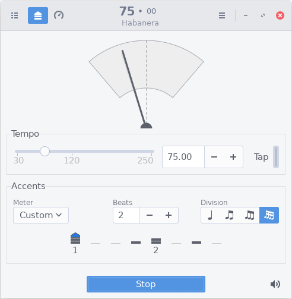

GMetronome
==========
GMetronome is a free/libre software metronome and tempo measurement tool for GNU/Linux
and other Unix-like operating systems.



Features
--------
* Tempo range from 30 to 250 BPM
* Customizable accent patterns with three levels of accentuation
* Divisible beats for simple and compound meters
* Predefined patterns for widely used meters and time signatures
* Training function (smoothly increase or decrease tempo)
* Profile support (save/restore settings)
* Build-in synthesizer to customize click sounds
* Customizable keyboard shortcuts
* Support for various audio backends

Download, Building and Installation
-----------------------------------
GMetronome is distributed as compressed source tarball and can be downloaded from
our [releases page](https://gitlab.gnome.org/dqpb/gmetronome/-/releases).

To build GMetronome you need a couple of packages:

* GTK (3.24) and Glib (2.58)
* gtkmm (3.24)
* pkgconfig

Use your distributions package manager to install those packages.

GMetronome comes with built-in support for various audio frameworks and sound
servers. Depending on the target platform and user requirements, there may
occur other dependencies like:

* libpulse (PulseAudio support)
* libasound (native ALSA support on Linux)
* sys/soundcard.h (OSS support on FreeBSD, Linux, ...)

Install those packages according to your needs as well.

After unpacking the source tarball (``gmetronome-0.x.x.tar.bz2``), you need
to configure the package. If you want to install GMetronome in the default
location (e.g. in ``/usr/local``) with the default audio backends just run the
following command inside the package directory:

```
$ ./configure
```

To install GMetronome in a different location or with a different set of audio
backends use the ``--prefix`` option and the audio backend switches of the
configure script, e.g.:

```
$ ./configure --prefix=/my/install/dir --with-oss --without-pulseaudio
```

All configure options can be shown with ``./configure --help``.

Since GMetronome uses the NDEBUG macro, it will see a performance benefit
if passed to the preprocessor (be aware that this could make possible
troubleshooting more difficult):

```
$ ./configure CPPFLAGS="-DNDEBUG"
```

After successfully configuring the package you can compile the sources
and install the software:

```
$ make
$ make install
```

You will need to have write permissions for the installation directories,
especially if you want to install the package with a public prefix
(e.g. ``/usr/local``). In this case run ``make install`` using ``sudo``. You
will be asked for the system administrator password to get the necessary write
permissions.

```
$ sudo make install
```

Before running GMetronome please make sure, that the shared resources can be
found by the application. This might not be a problem, if you install the
package with the default installation prefix. Otherwise you can prepend the
directory to the environment variable ``XDG_DATA_DIRS``. Assuming that your
installation prefix was ``/my/install/dir`` type:

```
$ export XDG_DATA_DIRS=/my/install/dir/share:$XDG_DATA_DIRS
```

Then run GMetronome by

```
$ /my/install/dir/bin/gmetronome
```

See [INSTALL](INSTALL) for further details.

### Building from Git Repository
To build the current development version, clone the project's git repository:

```
$ git clone https://gitlab.gnome.org/dqpb/gmetronome.git
```

Change to the gmetronome directory and call ``autogen.sh`` to generate the
makefiles. This requires a working autotools (autoconf, automake) installation
to succeed.

```
$ cd gmetronome
$ NOCONFIGURE=1 ./autogen.sh
```

Then run the traditional GNU triplet (configure, make, make install) following
the description above.

How to report bugs
------------------
Please visit our project's [issues page](https://gitlab.gnome.org/dqpb/gmetronome/issues)
to view currently open issues or submit new bug reports.
