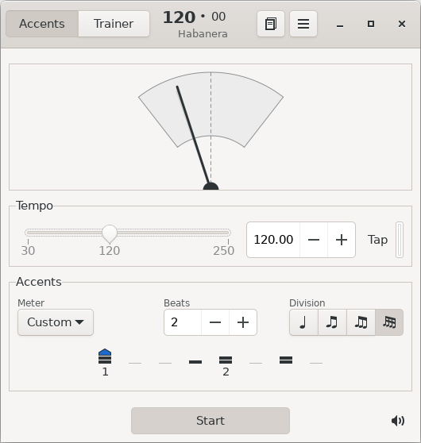

GMetronome
==========
A practical and precise tempo measurement tool for composers and musicians.



Features
--------
* Tempo range from 30 to 250 beats per minute
* Custom accentuation patterns
* Divisible beats for simple and compound meters
* Three accentuation levels for strong, middle and weak accents
* Pre defined patterns for widely used meters and time signatures
* Integrated synthesizer to customize click sounds
* Accurate trainer function to smoothly raise or lower tempo
* Profiles to (automatically) save and restore metronome settings
* Customizable keyboard shortcuts for nearly all metronome functions
* Support for different audio backends

Download, building and installation
-----------------------------------
GMetronome is currently under development. It is written for GNU/Linux and
other UN*X like operating systems and utilizes the C++ language binding for
GTK 3 (https://gtkmm.org).

It depends on the following packages:

* gtk+-3.0
* gtkmm-3.0
* alsa (optional)
* oss (optional)
* pulseaudio (optional)

Since there is no official release yet, clone the project's repository:

```
$ git clone https://gitlab.gnome.org/dqpb/gmetronome.git
```

Change to the gmetronome directory and call autogen.sh to generate the makefiles.
This requires a working autotools (autoconf, automake) installation to succeed.

```
$ cd gmetronome
$ NOCONFIGURE=1 ./autogen.sh
```

Then run the traditional GNU triplet to install GMetronome with the default installation prefix (/usr/local) and the default audio backend for your system:

```
$ ./configure
$ make

[ become super user if necessary ]
$ make install
```

To run GMetronome type:

```
$ gmetronome
```

### Custom installation directory

To install GMetronome with a different installation prefix (e.g. /my/install/dir) use the --prefix option of the 'configure' script. In this case you also need to tell GMetronome where to find it's resources, e.g. by setting the environment variable XDG_DATA_DIRS:

```
$ ./configure --prefix=/my/install/dir
$ make
$ make install

$ export XDG_DATA_DIRS=/my/install/dir/share:$XDG_DATA_DIRS
```

Then run GMetronome:

```
$ /my/install/dir/bin/gmetronome
```

See [INSTALL](INSTALL) for further details.

How to report bugs
------------------
Bugs should be reported on the project's [issues page](https://gitlab.gnome.org/dqpb/gmetronome/issues).
